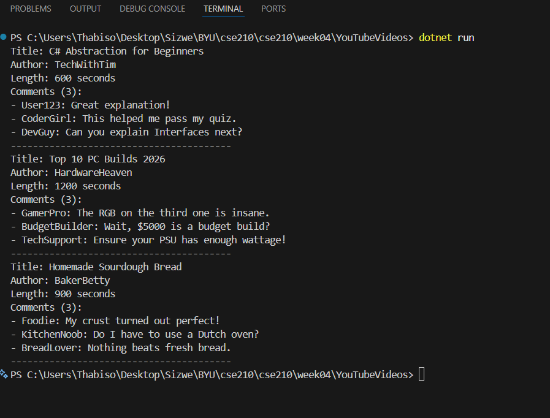
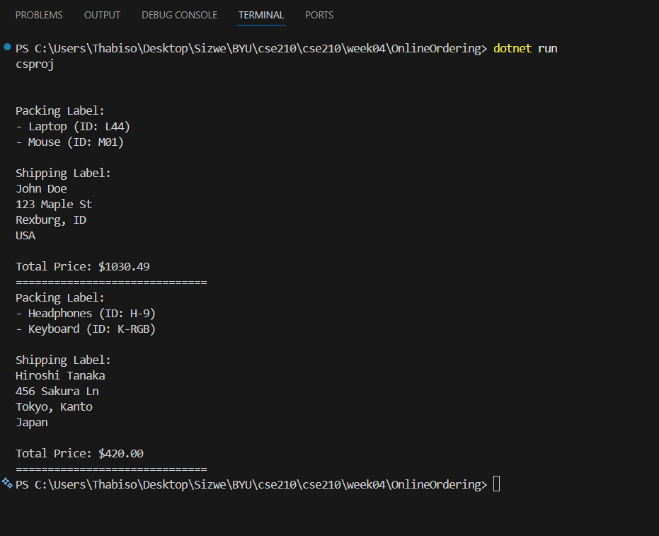

# W04 Foundation Programs: Technical Design

**Student:** Sizwe Athur Nkosi  
**Course:** CSE 210  

## Overview
This repository contains two programs demonstrating the core principles of Object-Oriented Programming: **Abstraction** and **Encapsulation**.

## Program 1: YouTube Video Tracking
**Design Goal:** Use **Abstraction** to manage a collection of videos and their associated comments without exposing internal list logic to the user.

| Class | Attributes (Private) | Behaviors (Public) |

| **Video** | `_title` (string), `_author` (string), `_length` (int), `_comments` (List<Comment>) | `AddComment(Comment)`, `GetCommentCount()`, `GetComments()` |
| **Comment** | `_name` (string), `_text` (string) | `Comment(name, text)` (Constructor) |

**Key Feature:** The `Video` class acts as the authority on its own data, providing a reporter method (`GetCommentCount`) so the calling code doesn't have to manually count the list.

---

## Program 2: Online Ordering System
**Design Goal:** Use **Encapsulation** and **Object Composition** to calculate order costs and generate labels for a global customer base.

| Class | Attributes (Private) | Behaviors (Public) |

| **Order** | `_products` (List<Product>), `_customer` (Customer) | `CalculateTotal()`, `GetPackingLabel()`, `GetShippingLabel()` |
| **Product** | `_name` (string), `_productId` (string), `_price` (double), `_quantity` (int) | `GetTotalCost()`, `GetLabelInfo()` |
| **Customer** | `_name` (string), `_address` (Address) | `IsInUSA()`, `GetName()`, `GetAddressString()` |
| **Address** | `_street` (string), `_city` (string), `_state` (string), `_country` (string) | `IsInUSA()`, `GetFullAddress()` |

**Key Feature:** This program uses **Delegation**. The `Order` asks the `Customer` if they are in the USA; the `Customer` in turn asks the `Address` object. This ensures each class only handles logic relevant to its own data.

## Execution Screenshots

### YouTube Video Program

### Online Ordering Program
