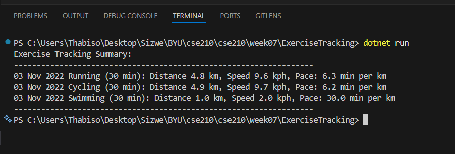

# Exercise Tracking Program (Foundation #3)

A C# console application designed to demonstrate the final principles of Object-Oriented Programming: **Inheritance** and **Polymorphism**.

## 🏃 Project Overview

This program allows users to track different types of fitness activities—Running, Stationary Cycling, and Swimming. While each activity tracks different raw data (distance, speed, or laps), they all provide a consistent summary including distance, speed, and pace in metric units.

## 🛠️ Key Technical Principles

* **Abstraction**: Used an abstract `Activity` base class to define a common interface for all exercise types.
* **Encapsulation**: All member variables are `private`, using `protected` methods to share necessary data with derived classes.
* **Inheritance**: Derived classes (`Running`, `Cycling`, `Swimming`) inherit shared attributes like date and duration from the `Activity` class.
* **Polymorphism**: Implemented through method overriding (`override`) for distance, speed, and pace calculations. A single `GetSummary` method in the base class handles the display logic for all types.

## 📊 Sample Execution

> **Summary Example:**
> 03 Nov 2022 Running (30 min): Distance 4.8 km, Speed 9.6 kph, Pace: 6.3 min per km
